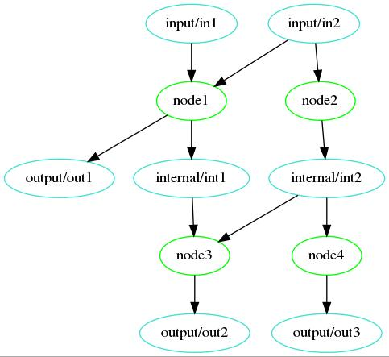
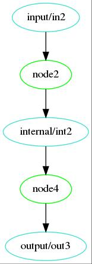
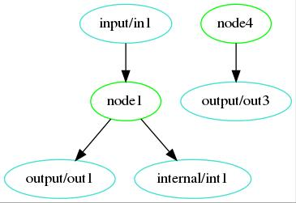
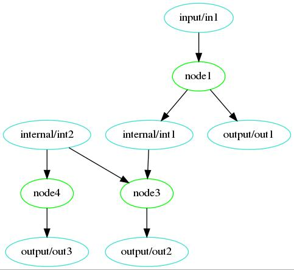
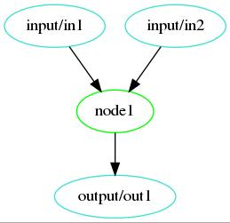

.. _quickstart:

Quickstart
==========

This page walks you through the example application to get you started.  It
assumes you already have OKCompute installed.  If you do not, head over to the
:ref:`installation` section.

The included example application "example/example_app.py" gives a command line interface for testing
the basic okcompute functionality:

.. autofunction:: example_app.main

usage::

    example_app.py [-h] [--in1 IN1] [--in2 IN2]
                        [--fail-nodes FAIL_NODES [FAIL_NODES ...]]
                        [--specify-outputs SPECIFY_OUTPUTS [SPECIFY_OUTPUTS ...]]
                        [--specify-internal SPECIFY_INTERNAL [SPECIFY_INTERNAL ...]]
                        [--save-graph SAVE_GRAPH]

    Run example_app

    optional arguments:
    -h, --help            show this help message and exit
    --in1 IN1             value for in1. Missing if not specified
    --in2 IN2             value for in2. Missing if not specified
    --fail-nodes FAIL_NODES [FAIL_NODES ...]
                            induce failures in the specified nodes (node1-4)
    --specify-outputs SPECIFY_OUTPUTS [SPECIFY_OUTPUTS ...]
                            Only run analysis for specified outputs (out1-3)
    --specify-internal SPECIFY_INTERNAL [SPECIFY_INTERNAL ...]
                            Skip analysis by specifying intermediate values
                            (int1-2)
    --save-graph SAVE_GRAPH
                            path to save graph of analysis

Overview
--------

This example passes strings between analysis stages and prints the results
along with a report on what processing occured. The graph of the analysis is:

This was generated with the --save-graph arguement and the command

.. code-block:: sh

    python example/example_app.py --in1 in1 --in2 in2 --save-graph test.png

Note that you need the optional PyGraphviz dependancy to generate plots.

You need to specify the input values since leaving them out would result in
only a subset of the analysis being able to run.

Application
-----------

.. literalinclude:: ../example/example_app.py
   :lines: 12-15

Fields
------

.. literalinclude:: ../example/example_app.py
   :lines: 17-37

Nodes
-----

The nodes are functions with the @example_app.metric decorator. This decorator
specifies the input and output fields for the metric. This along with the
parameters the function takes, specify it's properties in the analysis set.

Each of these nodes adds some text to their input strings to trace the analysis.

They check the nodes_to_fail variable in the module and will raise an exception
if their function name is in the list.

For example:

.. autofunction:: example_app.node1

and

.. autofunction:: example_app.node4

Running Analysis
----------------

Based on the command line arguements a data_map is constructed. This is passed
into the run function of the example application:

.. literalinclude:: ../example/example_app.py
   :lines: 155-158

The report is a description of what analysis was performed.

This report along with the contents of the data_map are then printed as json

Examples
--------

Example1
^^^^^^^^

.. code-block:: sh

    python example/example_app.py --in2 in2 --save-graph test.png

Report:

.. code-block:: json

    {
        "existing_results_skipped": [],
        "meta_data": {
            "app_meta": {
                "app_name": "example_app",
                "app_version": "1.0"
            },
            "elapsed": 0.0005397938657552004,
            "meta_args": "",
            "okcompute_ver": "1.0.0",
            "run_time": "2018-08-23 17:59:33.872258"
        },
        "metrics_missing_input": {
            "node1": {
                "bad_field": "input/in1",
                "has_default": false,
                "reason": "Missing input"
            },
            "node3": {
                "bad_field": "input/in1",
                "has_default": false,
                "reason": "Missing input"
            }
        },
        "run_results": {
            "node2": {
                "elapsed": 4.013720899820328e-05,
                "result": "Success"
            },
            "node4": {
                "elapsed": 3.7007033824920654e-05,
                "result": "Success"
            }
        },
        "unneeded_metrics": []
    }

data_map:

.. code-block:: json

    {
        "input": {
            "in2": "in2"
        },
        "internal": {
            "int2": "node2_1[in2]"
        },
        "output": {
            "out3": "node4_1[node2_1[in2]]"
        }
    }

Example2
^^^^^^^^

.. code-block:: sh

    python example/example_app.py --in1 in1 --save-graph test.png

Report:

.. code-block:: json

    {
        "existing_results_skipped": [],
        "meta_data": {
            "app_meta": {
                "app_name": "example_app",
                "app_version": "1.0"
            },
            "elapsed": 0.0005211718380451202,
            "meta_args": "",
            "okcompute_ver": "1.0.0",
            "run_time": "2018-08-23 18:07:37.176488"
        },
        "metrics_missing_input": {
            "node2": {
                "bad_field": "input/in2",
                "has_default": false,
                "reason": "Missing input"
            },
            "node3": {
                "bad_field": "input/in2",
                "has_default": false,
                "reason": "Missing input"
            },
            "node4": {
                "bad_field": "input/in2",
                "has_default": true,
                "reason": "Missing input"
            }
        },
        "run_results": {
            "node1": {
                "elapsed": 4.7386856749653816e-05,
                "result": "Success"
            },
            "node4": {
                "elapsed": 1.2567033991217613e-05,
                "result": "Success"
            }
        },
        "unneeded_metrics": []
    }

data_map:

.. code-block:: json

    {
        "input": {
            "in1": "in1"
        },
        "internal": {
            "int1": "node1_2[in1, default1]"
        },
        "output": {
            "out1": "node1_1[in1, default1]",
            "out3": "node4_1[fallback]"
        }
    }

Example3
^^^^^^^^

.. code-block:: sh

    python example/example_app.py --in1 in1  --specify-internal int2 --save-graph test.png

Report:

.. code-block:: json

    {
        "existing_results_skipped": [
            "node2"
        ],
        "meta_data": {
            "app_meta": {
                "app_name": "example_app",
                "app_version": "1.0"
            },
            "elapsed": 0.0006006751209497452,
            "meta_args": "",
            "okcompute_ver": "1.0.0",
            "run_time": "2018-08-23 18:10:28.268170"
        },
        "metrics_missing_input": {},
        "run_results": {
            "node1": {
                "elapsed": 4.170299507677555e-05,
                "result": "Success"
            },
            "node3": {
                "elapsed": 3.31320334225893e-05,
                "result": "Success"
            },
            "node4": {
                "elapsed": 4.4310931116342545e-05,
                "result": "Success"
            }
        },
        "unneeded_metrics": []
    }

data_map:

.. code-block:: json

    {
        "input": {
            "in1": "in1"
        },
        "internal": {
            "int1": "node1_2[in1, default1]",
            "int2": "int2[Existing]"
        },
        "output": {
            "out1": "node1_1[in1, default1]",
            "out2": "node3_1[node1_2[in1, default1], int2[Existing]]",
            "out3": "node4_1[int2[Existing]]"
        }
    }

Example4
^^^^^^^^

.. code-block:: sh

    python example/example_app.py --in1 in1  --in2 in2 --specify-outputs out1 --save-graph test.png

Report:

.. code-block:: json

    {
        "existing_results_skipped": [],
        "meta_data": {
            "app_meta": {
                "app_name": "example_app",
                "app_version": "1.0"
            },
            "elapsed": 0.000489966943860054,
            "meta_args": "",
            "okcompute_ver": "1.0.0",
            "run_time": "2018-08-23 18:16:39.424180"
        },
        "metrics_missing_input": {},
        "run_results": {
            "node1": {
                "elapsed": 4.816614091396332e-05,
                "result": "Success"
            }
        },
        "unneeded_metrics": [
            "node2",
            "node3",
            "node4"
        ]
    }

data_map:

.. code-block:: json

    {
        "input": {
            "in1": "in1",
            "in2": "in2"
        },
        "internal": {
            "int1": "node1_2[in1, in2]"
        },
        "output": {
            "out1": "node1_1[in1, in2]"
        }
    }
